# How to update this profile

The whole README visual is **one self-contained, animated SVG**, generated from a
small templated Node script. You never hand-edit the SVG — you edit your data and
rebuild.

```
purpoint/
├─ assets/
│  ├─ avatar.jpeg        ← your photo (embedded into the SVG as base64)
│  ├─ profile.svg        ← generated · DARK theme  (do not edit by hand)
│  └─ profile-light.svg  ← generated · LIGHT theme (do not edit by hand)
├─ scripts/
│  ├─ data.js            ← EDIT THIS: all text, projects, stack, socials
│  └─ build.js           ← the generator (layout, palettes, animations)
├─ README.md             ← embeds the SVG + a plain-text accessibility fallback
└─ NOTES.md              ← this file
```

## The update loop

1. **Edit your content** in [`scripts/data.js`](scripts/data.js) — name, tagline,
   role, blurb, education, value cards, projects, tech stack, socials, footer.
   (Colours, fonts, sizes and animations live in [`scripts/build.js`](scripts/build.js).)

2. **Rebuild** both SVGs (needs Node — no dependencies to install):

   ```bash
   npm run build        # or:  node scripts/build.js
   ```

   This regenerates `assets/profile.svg` and `assets/profile-light.svg`.

3. **Bust the cache.** GitHub serves README images through its camo proxy, which
   caches aggressively. After a rebuild, bump the version query in **both** image
   lines of `README.md`:

   ```diff
   - 
   + 
   - 
   + 
   ```

4. **Commit & push:**

   ```bash
   git add -A
   git commit -m "Update profile"
   git push origin main
   ```

   Then hard-refresh your profile page (Cmd/Ctrl+Shift+R). If a stale image
   lingers, bump `?v=` again — that always forces a fresh fetch.

## Changing the photo

Drop a new square image (≈1024×1024, JPEG) at `assets/avatar.jpeg`, then run
`npm run build`. It is re-embedded as a base64 data URI, so the SVG stays fully
self-contained (no external image request, which GitHub's camo proxy would block).

## Light / dark themes

- `profile.svg` = dark (primary) · `profile-light.svg` = light.
- `README.md` shows the right one using GitHub's `#gh-dark-mode-only` /
  `#gh-light-mode-only` image fragments, which follow the viewer's GitHub theme.
- Tweak the `PALETTES.dark` / `PALETTES.light` objects in `build.js` to recolour.

## Preview locally before pushing

Open `assets/profile.svg` directly in any browser, or test the real GitHub
render path (SVG inside an ``):

```bash
# minimal: drop an  into an HTML file and open it,
# or serve the folder and view in a browser:
python3 -m http.server 8080   # then open http://localhost:8080/assets/profile.svg
```

## Why it has to be an SVG (the constraints)

GitHub sanitizes README HTML (no `<style>`, `<script>`, `class=`, or inline CSS),
and SVGs embedded via `` cannot run JavaScript. So the entire visual is one
SVG that uses **only** CSS `@keyframes` + SMIL for animation, with the avatar
inlined and **no external font/image/CSS references**. Keep it that way when
editing `build.js`:

- no `@import`, web fonts, or external URLs (use generic font families);
- animate with CSS keyframes / SMIL only — never `<script>`;
- keep the content visible at rest (the entrance must look complete as a static
  frame, since a cached still may be shown before animation runs);
- re-validate after changes:  `xmllint --noout assets/profile.svg`.
